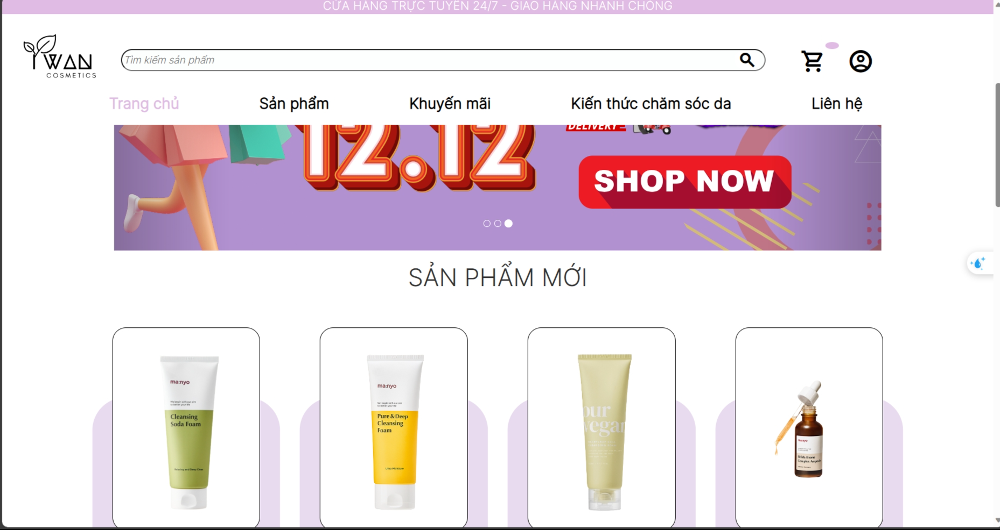

# TWAN Cosmetic

TWAN Cosmetic, a compact yet effective e-commerce platform, is designed with a focus on beauty products. Bringing simplicity and functionality together, this project aims to provide a straightforward online shopping experience for beauty enthusiasts. This README provides an overview of the project, including installation instructions, technologies used, and key features.

## Table of Contents

- [TWAN Cosmetic](#twan-cosmetic)
  - [Table of Contents](#table-of-contents)
  - [Installation](#installation)
  - [Technologies Used](#technologies-used)
  - [Features](#features)
  - [Use Case Diagram](#use-case-diagram)
  - [Contact](#contact)

## Installation

To get started with TWAN Cosmetic, follow these simple steps:

1. Clone the repository: `git clone https://github.com/DucTai0909/TWAN_Cosmetic.git`.
2. Install PHP and set up local environment (e.g., XAMPP).
3. Setup database in the `Database.sql` file.
4. Run the application.

## Technologies Used

- **Frontend:**
  - HTML, CSS, JavaScript

- **Backend:**
  - PHP

## Features

- Search and filter products by brand, price.
- Place orders and manage order details.
- Apply vouchers and proceed with payments.
- Admin: CRUD operations for orders, products, and vouchers.
- Admin: Revenue analytics. 

## Use Case Diagram

## Contact

For any inquiries or support, please contact me at nguyentoductai@gmail.com.
